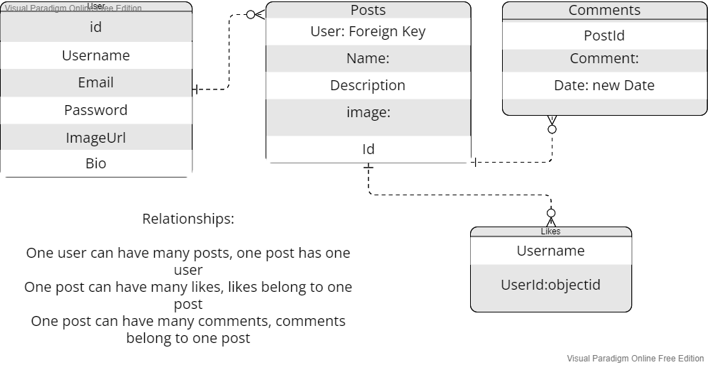
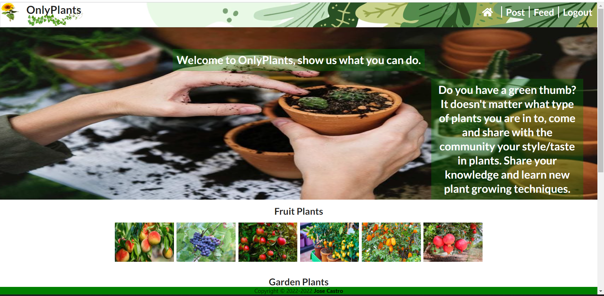
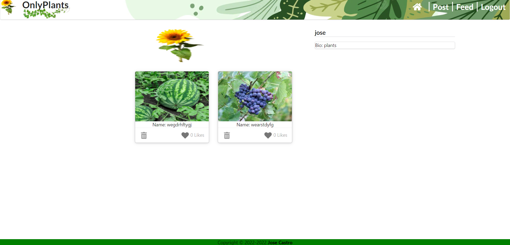
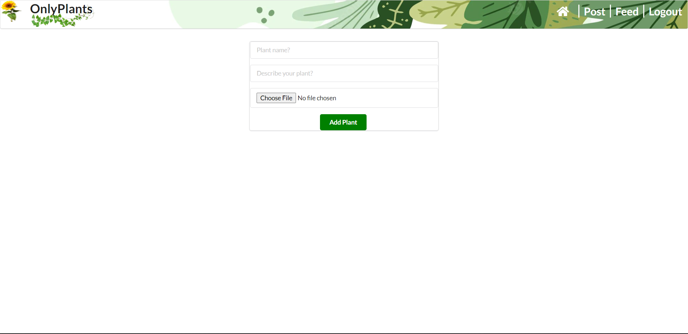
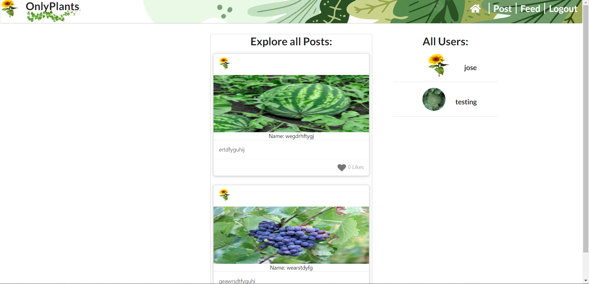

# OnlyPlants:

This mobile responsive application is meant as a way for users to share their love for their plants.

In this application users are able to signup to create their profile. Once they are logged in, they are able to see all of the posts users have created and also are able to create their own posts. Users can go to a certain post and comment on it or like a post. If a user is interested in a post they can also view the users profile page and see more of their posts.

 

## User Stories

-  AAU, I want to be able to signup, login, logout.
-  AAU, I want to be able to create profile to store my information.
-  AAU, I want to be able add an image to my profile.
-  AAU, I want to see other users posts.
-  AAU, I want to comment on posts.
-  AAU, I want to delete my comments.
-  AAU, I want to be able to like and unlike a post.
-  AAU, I want to see my own profile page.

## ERD

## Screenshots:

 

## Getting Started
## User Stories | ERD Diagram | Wireframes 

-   [Trello Board](https://trello.com/b/heawhlzY/project-4)
-   [OnlyPlants](https://onlyplants23.herokuapp.com/)

 

#### Technologies used:

> React
>
> AWS S3
>
> Express
>
> Javascript
>
> Jquerymulter
>
> CSS
>
> semantic-ui
>
> jsonwebtoken

#### Next Steps:

-   Add a way for users to follow each other
-   Add API for plant health
-   Add API for plant identification
-   Add a way for uses to search though the posts
-   Add further Mobile Responsive CSS to enhance user flow
